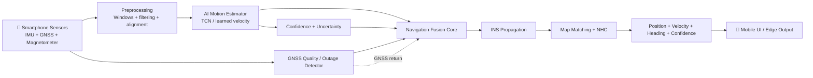
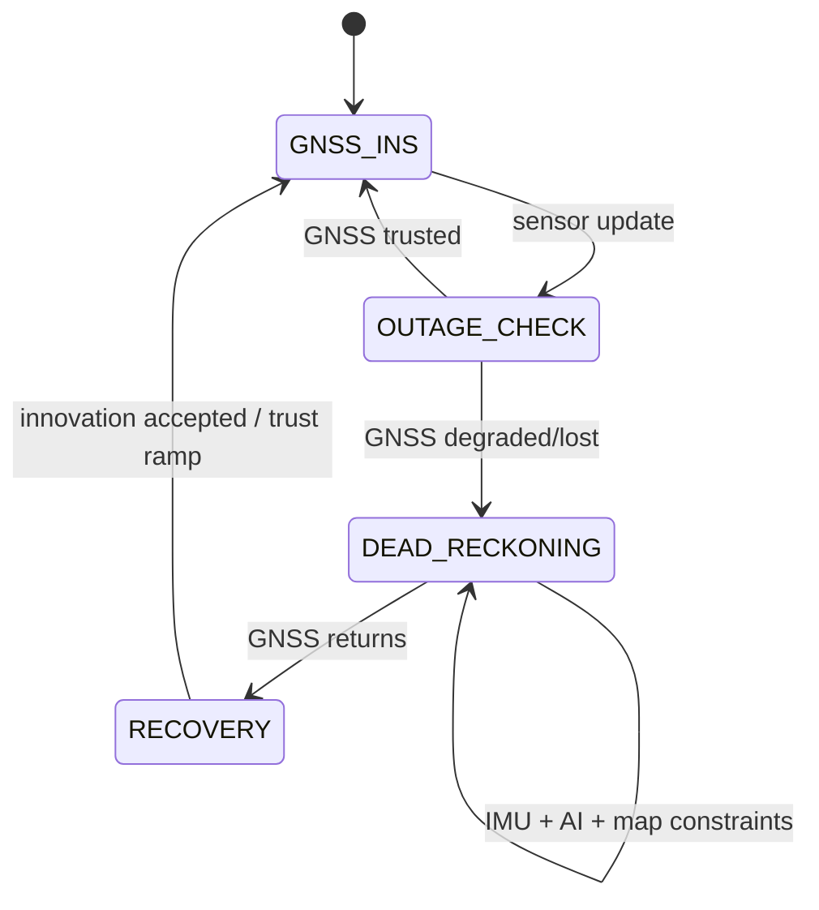
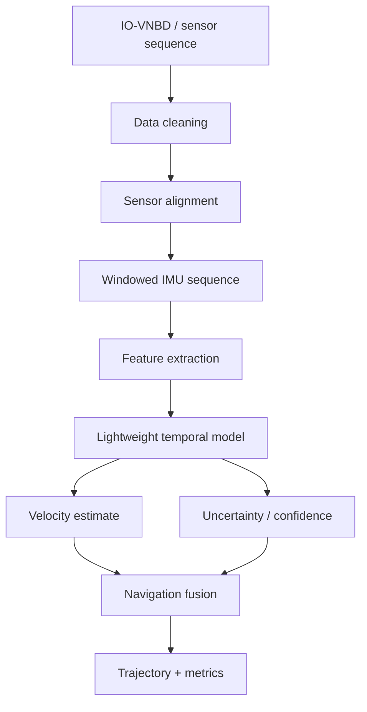
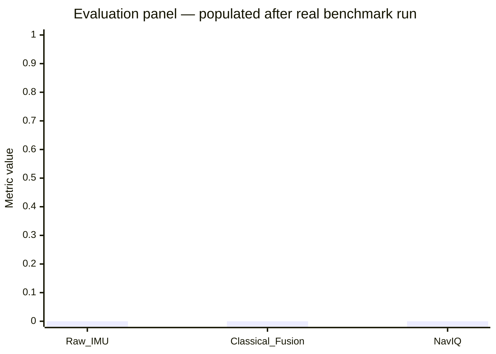
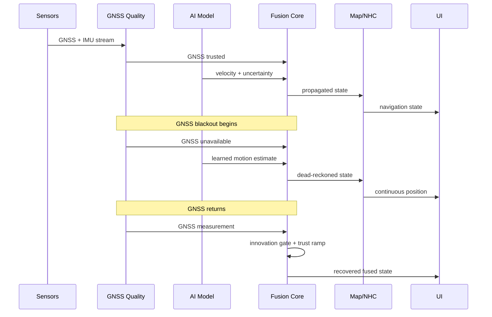

<div align="center">

<a href="https://github.com/abidshareef/SIH26168">
  
</a>

# 🛰️ NavIQ

### AI-ML Intelligent Dead Reckoning for Seamless Navigation

**SIH 2026 · Problem Statement 26168 · ISRO**

<p>
  <a href="#-what-the-judge-can-see">What the judge can see</a> ·
  <a href="#-how-it-works">How it works</a> ·
  <a href="#-live-demo">Live demo</a> ·
  <a href="#-evaluation">Evaluation</a> ·
  <a href="#-research">Research</a>
</p>

[](https://www.sih.gov.in/)
[](#-the-problem)
[](#-ai-ml-pipeline)
[](#-how-it-works)
[](https://www.python.org/)
[](#-quick-start)

</div>

---

## ⚡ 30-second judge summary

> **NavIQ turns a smartphone into an intelligent dead-reckoning navigator that continues estimating vehicle position when GNSS disappears.**

Instead of treating GNSS loss as a navigation failure, NavIQ switches to a **confidence-aware IMU + AI + navigation-fusion pipeline**, uses learned motion information to constrain inertial drift, and applies road/vehicle constraints before gradually trusting GNSS again after recovery.

### The judge should understand these 5 things immediately

| | Capability | What it means in the demo |
|---|---|---|
| 📡 | **GNSS outage detection** | Detects when satellite positioning becomes unreliable/unavailable |
| 🤖 | **AI motion estimation** | Estimates vehicle motion from smartphone IMU windows |
| 🧭 | **Dead reckoning** | Navigation continues during the outage instead of freezing |
| 🗺️ | **Map + vehicle constraints** | Physically implausible motion is constrained |
| 🔄 | **Adaptive recovery** | GNSS is reintroduced through an innovation/trust gate |

> **Important:** the current repository explicitly labels synthetic/demo outputs as synthetic. Real benchmark claims are only made after IO-VNBD evaluation is completed.

---

## 🎯 The problem

GNSS is excellent when satellite measurements are available. It becomes unreliable or unavailable in environments such as:

- 🚇 tunnels and underground transport
- 🅿️ multi-level parking structures
- 🏙️ dense urban corridors
- 🏔️ obstructed environments
- 📡 GNSS-denied / degraded areas

A conventional navigation stack can lose its absolute position reference when GNSS disappears.

### SIH 26168 asks for a practical alternative

Use **smartphone inertial sensors + AI/ML + GNSS/INS fusion** to maintain navigation through GNSS outages, while keeping the solution suitable for real-time/edge deployment.

---

## 👀 What the judge can see

### 1. Start in normal navigation

```text
GNSS available
      ↓
GNSS + INS fusion
      ↓
Stable position / velocity / heading
```

### 2. Simulate or enter a GNSS blackout

```text
GNSS quality ↓
      ↓
Outage detector
      ↓
Dead-reckoning mode
```

### 3. Watch the estimated trajectory continue

```text
                    GNSS BLACKOUT
                         ↓↓↓
Ground truth   ──────────────────────────
Raw IMU        ───────────────╱╱╱╱╱╱╱
NavIQ          ───────────────╱─────────
                              ↑
                       corrected trajectory
```

### 4. Restore GNSS

```text
GNSS reacquired
      ↓
innovation gate
      ↓
trust ramp
      ↓
GNSS + INS restored
```

The important visual is not merely a moving marker. It is **trajectory continuity during the blackout + measurable drift + controlled recovery**.

---

# 🧠 How it works


### Interactive architecture



---

# 🔄 Seamless GNSS ↔ Dead Reckoning




### Why this matters

The system is designed as **one continuous navigation state**, not two unrelated apps:

```text
             normal                         outage
GNSS ────────────────┐                    ┌──────────────
                     ▼                    ▼
              ┌────────────┐       ┌──────────────┐
IMU ─────────►│ Fusion     │──────►│ Dead         │
              │ Core       │       │ Reckoning    │
              └────────────┘       └──────────────┘
                     ▲                    │
                     └──── GNSS return ──┘
```

---

# 🤖 AI/ML pipeline



### Model role

AI is **not replacing inertial navigation physics**.

The intended architecture is:

```text
Physics model
      +
State estimation
      +
Learned motion correction
      +
Vehicle / road constraints
      ↓
Intelligent navigation
```

The repository currently contains a compact **PyTorch TCN** path for velocity estimation and residual-based uncertainty. The interfaces are deliberately modular so a production ESKF/InEKF, improved alignment, map matcher, or mobile inference backend can replace prototype components without rewriting the entire application.

---

# 📉 The drift problem — visualized

### Why raw IMU alone is not enough

Double integration of noisy MEMS measurements causes accumulated position error.

```text
Small sensor error
       ↓
Velocity error
       ↓
Position error
       ↓
Growing trajectory drift
```

### NavIQ attacks drift at multiple points

```text
                    ┌───────────────┐
                    │ Raw IMU       │
                    └───────┬───────┘
                            ↓
                    ┌───────────────┐
                    │ Preprocessing │
                    └───────┬───────┘
                            ↓
                    ┌───────────────┐
                    │ AI velocity   │
                    │ estimation    │
                    └───────┬───────┘
                            ↓
                    ┌───────────────┐
                    │ Fusion /      │
                    │ uncertainty   │
                    └───────┬───────┘
                            ↓
                    ┌───────────────┐
                    │ NHC + map     │
                    │ constraints   │
                    └───────┬───────┘
                            ↓
                    ┌───────────────┐
                    │ Position      │
                    └───────────────┘
```

---

# 📊 Evaluation

## What we measure

| Metric | Why it matters |
|---|---|
| **ATE** | Overall trajectory deviation |
| **RTE** | Local relative drift |
| **Drift %** | Error relative to travelled distance |
| **Velocity RMSE** | AI motion-estimation quality |
| **Heading error** | Direction stability |
| **Inference latency** | Real-time feasibility |
| **Update rate** | Navigation responsiveness |
| **RAM / model size** | Edge feasibility |
| **Recovery error** | Quality of GNSS re-entry |

### ⚠️ No fabricated benchmark numbers

The repository currently contains synthetic/demo replay support. **Do not interpret those generated metrics as real-vehicle performance.**

Once the IO-VNBD evaluation pipeline is run, this section should contain the actual measured plot and table:

```text
benchmark/
├── trajectories/
│   ├── ground_truth.csv
│   ├── raw_imu.csv
│   └── naviq.csv
├── metrics/
│   └── summary.json
└── figures/
    ├── trajectory_comparison.svg
    ├── error_over_time.svg
    └── drift_comparison.svg
```

### Judge-facing comparison



> The chart intentionally contains no fabricated results. Replace the values only from the evaluation output.

---

# 🧪 GNSS outage experiment

The replay pipeline makes the failure condition explicit.



---

# 🖥️ Live demo

## Run the integrated UI

```powershell
python -m uvicorn backend.api:app --host 127.0.0.1 --port 8000
```

Open:

```text
http://127.0.0.1:8000/
```

The backend serves the UI itself, so no second server or CORS configuration is required.

### Reproduce the complete local pipeline

```powershell
python -m backend.generate_data
python -m backend.train
python -m backend.predict
python -m backend.replay --data data/synthetic/demo_outage.csv --outage-start 30 --outage-duration 30
python -m uvicorn backend.api:app --reload
python -m pytest -q
```

### API health check

```powershell
Invoke-RestMethod http://127.0.0.1:8000/health
```

### Start an outage replay

```powershell
Invoke-RestMethod -Method Post 'http://127.0.0.1:8000/replay/run?outage_start=30&outage_duration=30'
```

### Interactive OpenAPI

```text
http://127.0.0.1:8000/docs
```

---

# 🧩 What is implemented vs what is still research-grade

This distinction is deliberate.

<details>
<summary><strong>✅ Implemented in the current prototype</strong></summary>

- deterministic synthetic sensor generation
- IMU window creation
- compact PyTorch TCN
- velocity inference
- residual-based uncertainty
- confidence-aware trust engine
- dynamic covariance handling
- outage / recovery replay
- trajectory metrics
- local FastAPI development API
- integrated local UI
- replaceable NHC / map-matching interfaces
- real-data IO-VNBD adapter path

</details>

<details>
<summary><strong>🔬 Production / research work still required</strong></summary>

- multi-route IO-VNBD validation
- cross-driver validation
- cross-device validation
- real smartphone field testing
- calibrated uncertainty
- production ESKF/InEKF
- robust phone-to-vehicle alignment
- production map matching
- Android on-device optimization
- long-duration GNSS outage testing

</details>

This prevents the README from confusing a **proof-of-architecture** with a finished automotive-grade navigation system.

---

# 📁 Repository map

```text
SIH26168/
│
├── backend/
│   ├── api.py
│   ├── train.py
│   ├── predict.py
│   ├── replay.py
│   └── generate_data.py
│
├── data/
│   └── synthetic/
│
├── docs/
│   └── assets/
│       ├── hero.svg
│       ├── architecture.svg
│       ├── workflow.svg
│       └── README.md
│
├── experiments/
│   ├── trajectories/
│   ├── metrics/
│   └── figures/
│
├── mobile/                 # mobile/on-device integration path
├── navigation/             # fusion / dead reckoning modules
├── ai/                     # training / inference modules
├── edge_engine/            # edge deployment path
├── requirements.txt
└── README.md
```

---

# 🛰️ SIH 26168 requirement mapping

| Requirement / challenge | NavIQ response |
|---|---|
| GNSS-denied navigation | IMU-based dead reckoning |
| Smartphone sensors | Accelerometer + gyroscope pipeline |
| AI/ML assistance | Temporal velocity estimation |
| Drift management | Fusion + learned correction + constraints |
| GNSS outage detection | GNSS quality / trust engine |
| Seamless recovery | Innovation gate + trust ramp |
| Vehicle behavior | NHC interface |
| Road structure | Map-matching interface |
| Edge deployment | Compact model + modular inference |
| Real-data validation | IO-VNBD adapter |
| Demonstrability | Local replay + API + UI |

---

# 🌍 Where this can be used

- 🚚 logistics and fleet vehicles
- 🚑 emergency-response navigation
- 🚗 consumer vehicles without advanced inertial hardware
- 🛵 smartphone-based two-wheeler navigation
- 🚇 underground / tunnel segments
- 🏙️ urban GNSS-degraded corridors

These are application directions, not claims of current certification or production readiness.

---

# 🔐 Engineering principles

### Edge first

Navigation should degrade gracefully when connectivity disappears.

### Physics + AI

AI provides learned information; the navigation state remains physically constrained.

### Confidence aware

Every estimate should have uncertainty rather than pretending every prediction is equally reliable.

### Modular

Sensor interfaces, model, fusion, map matching and UI are separated so they can evolve independently.

### Measurable

Every performance claim should be traceable to a reproducible experiment.

---

# 🧪 IO-VNBD real-data baseline

The repository does not contain benchmark payloads. Clone the upstream dataset with Git LFS and pull selected synchronized route pairs:

```powershell
git clone https://github.com/onyekpeu/IO-VNBD.git IO-VNBD-upstream
git -C IO-VNBD-upstream lfs pull --include="Synchronised V abd S datasets/Categorised IOVNB Dataset/S (Driver A)/S1/*.csv,Synchronised V abd S datasets/Categorised IOVNB Dataset/S (Driver A)/S2/*.csv"
python -m backend.train --iovnbd-root "IO-VNBD-upstream/Synchronised V abd S datasets/Categorised IOVNB Dataset" --epochs 20
```

The adapter uses phone accelerometer/gyroscope fields as inputs and vehicle speed as supervision, with a complete route held out for validation.

---

# 📚 Research foundation

The implementation is organized around four technical pillars:

```text
             ┌─────────────────────────┐
             │ Intelligent Navigation  │
             └────────────┬────────────┘
                          │
       ┌──────────────────┼──────────────────┐
       ▼                  ▼                  ▼
 GNSS/INS Fusion     Learned IMU       Map / Vehicle
                      Odometry          Constraints
       │                  │                  │
       └──────────────────┼──────────────────┘
                          ▼
                    Edge Inference
```

Recommended research references to attach before final submission:

1. IO-VNBD dataset paper / repository
2. learned inertial odometry literature
3. error-state Kalman filtering
4. invariant filtering for inertial navigation
5. smartphone inertial navigation
6. GNSS/INS outage and recovery methods

---

# 👥 Team

| Member | Responsibility |
|---|---|
| **[MEMBER 1]** | AI/ML + navigation |
| **[MEMBER 2]** | mobile application |
| **[MEMBER 3]** | backend + edge engine |
| **[MEMBER 4]** | research + evaluation |

---

# 🔗 Project links

| Resource | Link |
|---|---|
| 📦 GitHub repository | [Open repository](https://github.com/abidshareef/SIH26168) |
| 🎬 Demo video | **ADD LINK** |
| 📄 Research paper | **ADD LINK** |
| 📊 Benchmark report | **ADD LINK** |
| 📱 APK / mobile demo | **ADD LINK** |
| 🖥️ Live demo | **ADD LINK** |

---

<div align="center">

## 🛰️ When GNSS disappears, navigation shouldn't.

### **NavIQ — Intelligent Dead Reckoning for Seamless Navigation**

**SIH 2026 · Problem Statement 26168 · ISRO**

</div>
