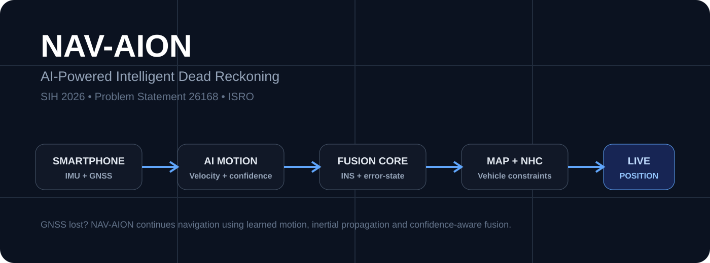
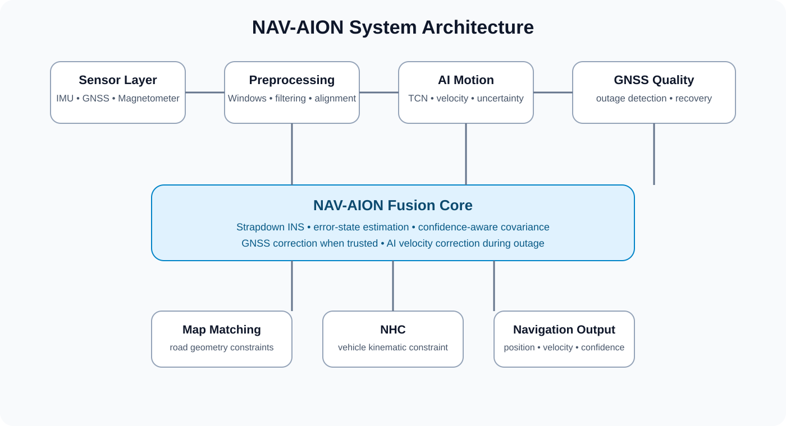
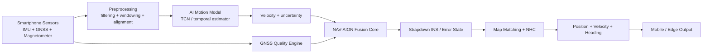
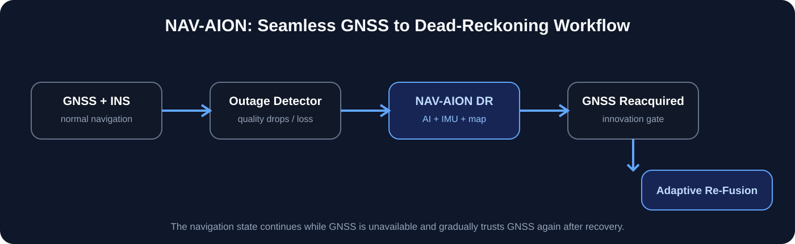
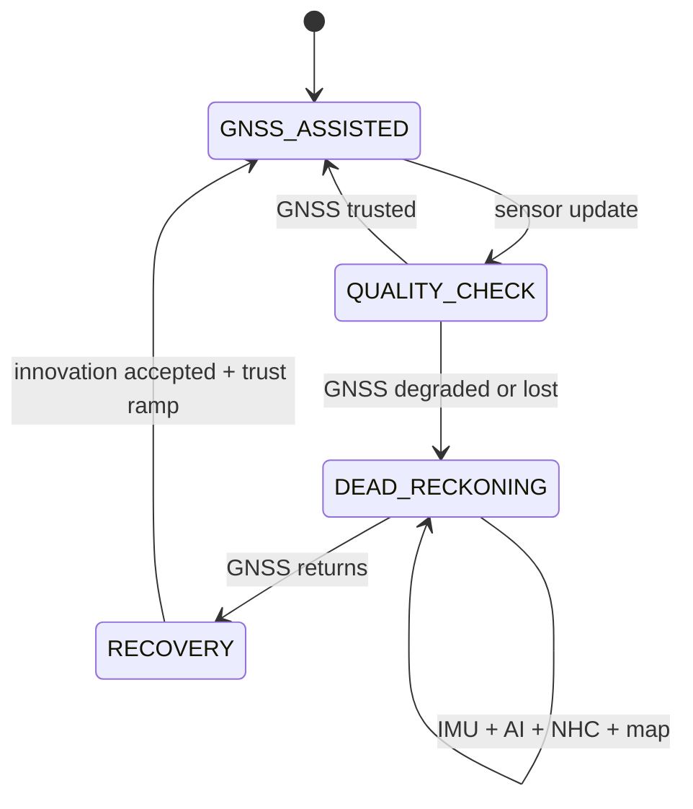
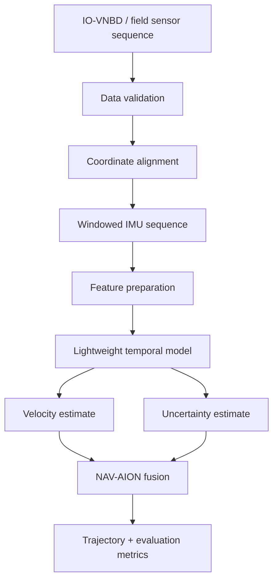
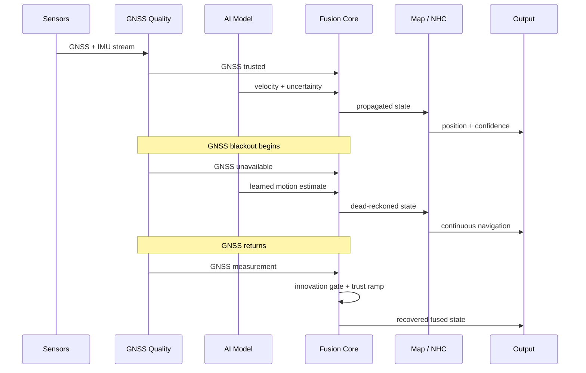

<div align="center">

<a href="https://github.com/abidshareef/SIH26168">
  
</a>

# NAV-AION

### AI-Powered Intelligent Dead Reckoning for Seamless GNSS-Denied Navigation

**SIH 2026 · Problem Statement 26168 · ISRO**

<p>
  <a href="#overview">Overview</a> ·
  <a href="#system-architecture">Architecture</a> ·
  <a href="#evaluation-framework">Evaluation</a> ·
  <a href="#quick-start">Quick Start</a> ·
  <a href="#research-baseline">Research</a>
</p>

[](https://www.sih.gov.in/)
[](#problem-statement)
[](#ai-ml-pipeline)
[](#system-architecture)
[](https://www.python.org/)

</div>

---

## Overview

**NAV-AION turns a smartphone into a resilient navigation sensor.** When GNSS becomes degraded or unavailable, the system transitions from GNSS-assisted navigation to AI-assisted inertial dead reckoning, while using vehicle constraints, map geometry and confidence-aware fusion to control drift and recover cleanly when GNSS returns.

The design combines four layers rather than relying on a single algorithm:

1. **Sensing:** smartphone IMU, GNSS and optional magnetometer/external sensors.
2. **AI motion estimation:** a lightweight temporal model estimates vehicle motion from inertial windows and produces uncertainty information.
3. **Navigation fusion:** strapdown INS and an error-state filtering architecture combine inertial propagation, GNSS updates and learned motion information.
4. **Physical constraints:** non-holonomic constraints and road/map geometry suppress physically implausible motion.

> **Evidence policy:** this repository distinguishes prototype behavior, SIH requirements, engineering targets and measured benchmark results. No synthetic demo number is presented as real-world performance.

---

## Problem Statement

GNSS can become unreliable or unavailable in tunnels, underground environments, parking structures, dense urban corridors and other signal-obstructed areas. SIH Problem Statement 26168 asks for an AI/ML-based intelligent dead-reckoning approach that can maintain vehicle navigation during GNSS outages using inertial sensing and sensor fusion, while remaining suitable for practical edge deployment.

### PS-aligned engineering targets

| Requirement / target | Value | Classification |
|---|---:|---|
| Smartphone navigation update | **10 Hz** | SIH requirement |
| FOG / high-rate edge processing reference | **~200 Hz** | SIH requirement |
| Example GNSS-denied distance | **1 km** | SIH evaluation scenario |
| Maximum drift for 1 km example | **<100 m** | SIH requirement |
| Maximum drift ratio | **<10%** | SIH requirement |
| Example 50 m outage | **<5 m error** | SIH example |
| Smartphone sample interval at 10 Hz | **0.10 s** | Calculated |
| Vehicle speed example | **60 km/h = 16.67 m/s** | Calculated |
| Travel per 10-Hz update at 60 km/h | **1.67 m/update** | Calculated |

The values above are requirements or calculations, not claims that NAV-AION has already achieved them.

---

## NAV-AION in one view



### Core idea

```text
                    GNSS available
                         |
                         v
              +-----------------------+
              | GNSS + INS navigation |
              +-----------+-----------+
                          |
                 GNSS quality drops
                          |
                          v
              +-----------------------+
              | NAV-AION outage mode  |
              | AI + IMU + constraints|
              +-----------+-----------+
                          |
                 GNSS becomes valid
                          |
                          v
              +-----------------------+
              | Confidence-aware      |
              | adaptive re-fusion    |
              +-----------------------+
```

---

# System Architecture

The system is deliberately modular so the prototype can evolve toward a production edge engine without replacing the entire stack.



### Continuous GNSS-to-dead-reckoning state





The key design principle is **continuity**: GNSS loss changes the measurement sources and confidence weights; it does not terminate the navigation state.

---

# AI/ML Pipeline



### Why AI is used

NAV-AION does not attempt to replace inertial navigation with a black-box model. The learned model supplies motion information that is difficult to obtain directly from low-cost MEMS sensors. The physics-based navigation layer remains responsible for state propagation, coordinate transformations and consistency.

```text
Physics model
      +
State estimation
      +
Learned motion information
      +
Vehicle / road constraints
      |
      v
Resilient navigation state
```

The current prototype includes a compact PyTorch temporal model path for velocity estimation and residual-based uncertainty. Production work can substitute a calibrated ESKF/IEKF, optimized mobile model, improved phone-to-vehicle alignment and production-grade map matcher.

---

# Drift Control

Raw inertial dead reckoning accumulates error because small acceleration and orientation errors integrate over time.

```text
Sensor noise
    |
    v
Velocity error
    |
    v
Position error
    |
    v
Trajectory drift
```

NAV-AION attacks this accumulation at multiple points:

```text
Raw IMU
   |
   v
Preprocessing and alignment
   |
   v
AI velocity / uncertainty
   |
   v
Error-state fusion
   |
   +------ GNSS when trusted
   |
   +------ NHC vehicle constraint
   |
   +------ Map / road constraint
   |
   v
Position + velocity + heading + confidence
```

### Worked PS calculation

At the SIH example speed of 60 km/h:

```text
60 km/h / 3.6 = 16.67 m/s

10 Hz update rate:
1 / 10 = 0.10 s

Distance travelled per update:
16.67 × 0.10 = 1.67 m
```

For a 1 km GNSS outage, a 10% drift ceiling corresponds to:

```text
1,000 m × 0.10 = 100 m maximum drift
```

These calculations define the evaluation boundary. They are not measured NAV-AION results.

---

# Evaluation Framework

NAV-AION should be evaluated against a reference trajectory, not only by visual inspection.

| Metric | Definition / purpose | Status |
|---|---|---|
| ATE | Absolute trajectory error | Benchmark metric |
| RTE | Relative trajectory error | Benchmark metric |
| Drift % | Position error / travelled distance × 100 | PS metric |
| Position RMSE | Root-mean-square position error | Benchmark metric |
| Velocity MAE/RMSE | AI motion-estimation quality | Benchmark metric |
| Heading error | Direction consistency | Benchmark metric |
| Recovery error | Error after GNSS re-entry | NAV-AION metric |
| Recovery latency | Time to stable re-fusion | Engineering target / measure |
| Inference latency | On-device model execution time | Engineering target / measure |
| Update rate | Navigation state throughput | PS requirement |
| Model size | Deployment footprint | Edge metric |
| RAM / CPU | Resource consumption | Edge metric |

### Evaluation dashboard structure

| Test | Reference | NAV-AION | Acceptance criterion |
|---|---:|---:|---|
| 50 m outage | ground truth | to measure | <5 m error target |
| 1 km outage | ground truth | to measure | <100 m error target |
| 10 Hz processing | timestamps | to measure | 10 Hz minimum target |
| GNSS recovery | reference state | to measure | stable, bounded correction |
| Cross-device test | reference trajectory | to measure | no device-specific failure |
| Long outage | reference trajectory | to measure | bounded drift growth |

> Do not replace “to measure” with invented numbers. Populate the dashboard from reproducible experiment output.

---

# Benchmark and Data Strategy

## IO-VNBD

The IO-VNBD dataset is the primary public-data baseline for development and evaluation. The published dataset contains approximately **58 hours / 4,400 km of smartphone recordings** and approximately **40 hours / 1,300 km of vehicle recordings**, with smartphone inertial/GNSS data sampled at 10 Hz and GPS at 1 Hz.

The evaluation plan should include:

1. Train/validation/test separation by route or drive session.
2. Multiple GNSS outage durations rather than a single blackout.
3. Different motion patterns and road conditions.
4. Cross-device testing where available.
5. Comparison of baseline inertial propagation against NAV-AION components.
6. Reproducible trajectory and error plots.

Reference: [IO-VNBD dataset paper](https://pmc.ncbi.nlm.nih.gov/articles/PMC7907232/)

---

# Ablation Study

The proposed architecture can be evaluated component-by-component.

| Configuration | GNSS | AI velocity | NHC | Map | Purpose |
|---|:---:|:---:|:---:|:---:|---|
| Baseline GNSS | Yes | No | No | No | GNSS reference |
| Pure DR | No | No | No | No | Raw inertial drift baseline |
| GNSS + filter | Yes | No | No | No | Classical fusion baseline |
| + AI velocity | Optional | Yes | No | No | Measure AI contribution |
| + NHC | Optional | Yes | Yes | No | Measure vehicle constraint |
| Full NAV-AION | Adaptive | Yes | Yes | Yes | Complete proposed system |

This makes the innovation measurable rather than relying on a qualitative claim.

---

# GNSS Outage Experiment



The demo should show three things: trajectory continuity, measurable drift, and controlled recovery.

---

# Quick Start

## Install

```powershell
python -m venv .venv
.\.venv\Scripts\activate
pip install -r requirements.txt
```

## Generate prototype data

```powershell
python -m backend.generate_data
```

## Train

```powershell
python -m backend.train
```

## Predict

```powershell
python -m backend.predict
```

## Replay a GNSS outage

```powershell
python -m backend.replay --data data/synthetic/demo_outage.csv --outage-start 30 --outage-duration 30
```

## Start the API and UI

```powershell
python -m uvicorn backend.api:app --host 127.0.0.1 --port 8000
```

Open `http://127.0.0.1:8000/`.

API documentation is available at `http://127.0.0.1:8000/docs`.

Health check:

```powershell
Invoke-RestMethod http://127.0.0.1:8000/health
```

---

# Prototype Scope vs Production Scope

## Implemented prototype capabilities

- Deterministic synthetic sensor generation
- IMU window creation
- Compact temporal model path
- Velocity inference
- Residual-based uncertainty
- Confidence-aware trust engine
- Outage and recovery replay
- Trajectory metrics
- Local FastAPI development API
- Integrated local UI
- Replaceable NHC and map-matching interfaces
- IO-VNBD adapter path

## Research / production work remaining

- Full multi-route IO-VNBD benchmark
- Cross-driver validation
- Cross-device validation
- Real smartphone field testing
- Calibrated uncertainty
- Production ESKF/IEKF implementation
- Robust automatic phone-to-vehicle alignment
- Production map matching
- Android on-device optimization
- Long-duration GNSS outage experiments

The distinction is intentional: NAV-AION is a research prototype and is not represented here as certified automotive navigation software.

---

# Repository Structure

```text
SIH26168/
├── backend/
│   ├── api.py
│   ├── train.py
│   ├── predict.py
│   ├── replay.py
│   └── generate_data.py
├── data/
│   └── synthetic/
├── docs/
│   └── assets/
│       ├── hero.svg
│       ├── architecture.svg
│       ├── workflow.svg
│       └── README.md
├── experiments/
│   ├── trajectories/
│   ├── metrics/
│   └── figures/
├── mobile/
├── navigation/
├── ai/
├── edge_engine/
├── requirements.txt
└── README.md
```

---

# SIH 26168 Requirement Mapping

| SIH challenge | NAV-AION response |
|---|---|
| GNSS-denied navigation | AI-assisted inertial dead reckoning |
| Smartphone sensing | IMU + GNSS + optional magnetometer |
| AI/ML assistance | Temporal motion / velocity estimation |
| Drift management | Error-state fusion + learned motion + constraints |
| GNSS outage detection | GNSS quality and confidence engine |
| Seamless recovery | Innovation gate + adaptive trust ramp |
| Vehicle motion | Non-holonomic constraint interface |
| Road structure | Map-matching interface |
| Edge feasibility | Compact model and modular inference |
| Public-data validation | IO-VNBD evaluation path |
| Demonstration | Replay + API + UI |

---

# Technology Stack

| Layer | Technology | Role |
|---|---|---|
| ML | PyTorch | Training and inference prototype |
| Temporal model | TCN | Lightweight sequence modelling |
| Navigation | Python | Prototyping and numerical processing |
| API | FastAPI / Uvicorn | Local service and demo API |
| Data | CSV / NumPy / Pandas | Sensor and trajectory processing |
| Mapping | OpenStreetMap-compatible workflow | Road constraints and visualization |
| Mobile path | Android / Flutter-compatible architecture | Smartphone deployment direction |
| Evaluation | Python metrics + plots | Reproducible benchmarking |

---

# Engineering Principles

### Edge first

The navigation state should remain useful when connectivity disappears.

### Physics plus AI

AI supplies learned information; the navigation state remains physically constrained.

### Confidence aware

Estimates should carry uncertainty so the fusion engine can reduce trust when the model is unreliable.

### Modular

Sensors, model, fusion, map matching and UI should evolve independently.

### Measurable

Every performance claim should trace back to a reproducible experiment.

### Deployment conscious

Model size, inference latency, memory and power are first-class engineering metrics, not afterthoughts.

---

# Roadmap

```text
Prototype
   |
   +--> IO-VNBD benchmark
   |
   +--> ESKF / IEKF integration
   |
   +--> automatic phone-vehicle alignment
   |
   +--> calibrated uncertainty
   |
   +--> Android on-device inference
   |
   +--> controlled field trials
   |
   +--> fleet-scale validation
   |
   +--> production-grade navigation platform
```

---

# Research Baseline

NAV-AION builds on established concepts in inertial navigation, GNSS/INS integration, error-state filtering, learned inertial odometry, vehicle constraints and map matching. The proposed contribution is the integration of these mechanisms into a smartphone-first, confidence-aware GNSS outage workflow with an explicit edge-deployment objective.

Useful references include:

- IO-VNBD: https://pmc.ncbi.nlm.nih.gov/articles/PMC7907232/
- OpenStreetMap: https://www.openstreetmap.org/
- PyTorch: https://pytorch.org/
- FastAPI: https://fastapi.tiangolo.com/

---

## Project Identity

**NAV-AION**

**AI-Powered Intelligent Dead Reckoning for Seamless GNSS-Denied Navigation**

**Navigate Beyond the Signal.**

Built for **SIH 2026 Problem Statement 26168 — ISRO**.

<div align="center">

**GNSS lost. Navigation continues.**

</div>
